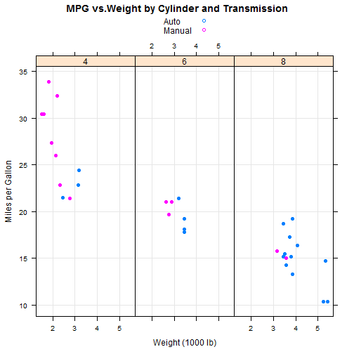
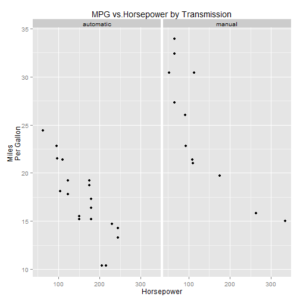

## Problem Statement

* With the recent surge in gas prices we would like to identify the features in a car that affect gas mileage. 

* Consider the following features of the car for building this app.

  * Weight, Horsepower (numeric) 
  * Transmission, Number of Cylinders, Number of Gears (categorical)

## Methodology

* Load the dataset 'mtcars' for analysis (type ?mtcars in R for documentation)

* Exploratory analysis - quick graphs to test our claim.

* Fit regression model

* Use the model for prediction

--- .class #id 

 
## Exploratory analysis 

---

## Regression Model
$\rm mpg=\beta_0 \rm weight + \beta_1 \rm transmission+\beta_3 \rm cylinders +
\beta_4\rm gear+\beta_5 \rm horsepower +\rm error$
<!-- html table generated in R 3.0.3 by xtable 1.7-3 package -->
<!-- Thu Jun 19 12:00:30 2014 -->
<TABLE border=1>
<TR> <TH>  </TH> <TH> Estimate </TH> <TH> Std. Error </TH> <TH> t value </TH> <TH> Pr(&gt;|t|) </TH>  </TR>
  <TR> <TD align="right"> (Intercept) </TD> <TD align="right"> 33.5585 </TD> <TD align="right"> 2.7435 </TD> <TD align="right"> 12.23 </TD> <TD align="right"> 0.0000 </TD> </TR>
  <TR> <TD align="right"> wt </TD> <TD align="right"> -2.4469 </TD> <TD align="right"> 0.9706 </TD> <TD align="right"> -2.52 </TD> <TD align="right"> 0.0188 </TD> </TR>
  <TR> <TD align="right"> as.factor(am)1 </TD> <TD align="right"> 1.3643 </TD> <TD align="right"> 1.7601 </TD> <TD align="right"> 0.78 </TD> <TD align="right"> 0.4459 </TD> </TR>
  <TR> <TD align="right"> as.factor(cyl)6 </TD> <TD align="right"> -2.8970 </TD> <TD align="right"> 1.4865 </TD> <TD align="right"> -1.95 </TD> <TD align="right"> 0.0631 </TD> </TR>
  <TR> <TD align="right"> as.factor(cyl)8 </TD> <TD align="right"> -1.4670 </TD> <TD align="right"> 2.8068 </TD> <TD align="right"> -0.52 </TD> <TD align="right"> 0.6060 </TD> </TR>
  <TR> <TD align="right"> as.factor(gear)4 </TD> <TD align="right"> 0.6692 </TD> <TD align="right"> 1.8057 </TD> <TD align="right"> 0.37 </TD> <TD align="right"> 0.7142 </TD> </TR>
  <TR> <TD align="right"> as.factor(gear)5 </TD> <TD align="right"> 1.1360 </TD> <TD align="right"> 2.4853 </TD> <TD align="right"> 0.46 </TD> <TD align="right"> 0.6517 </TD> </TR>
  <TR> <TD align="right"> hp </TD> <TD align="right"> -0.0361 </TD> <TD align="right"> 0.0180 </TD> <TD align="right"> -2.01 </TD> <TD align="right"> 0.0561 </TD> </TR>
   </TABLE>

---
## Results
* Mileage is directly proportional to weight
* Manual transmission is fuel efficient
* Inverse relationship between horse power and mpg
* A 4 cylinder car and a manual transmission then you get the best gas mileage.

Have fun playing with this app!

